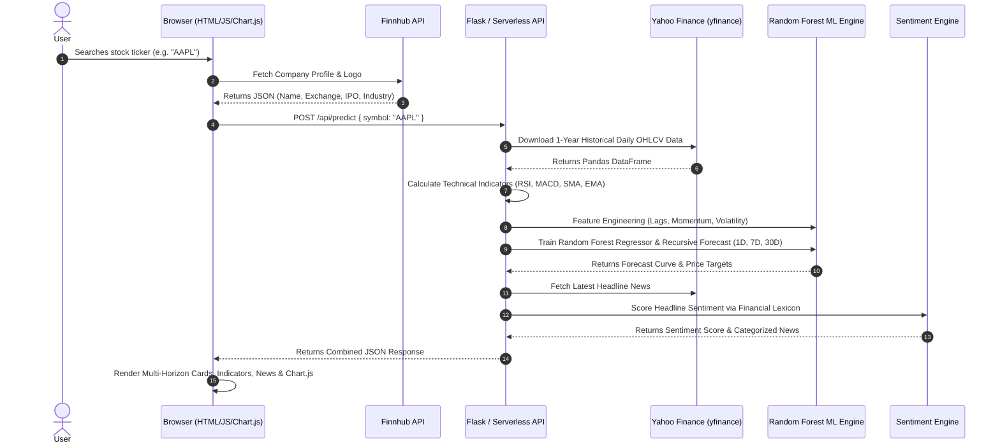

# 📚 StockVision AI — Complete Study & Technical Notes

Welcome to the comprehensive study and technical guide for **StockVision AI**. This document is designed to give you a complete, deep understanding of the architecture, machine learning models, quantitative technical indicators, financial sentiment analysis, and code structure—ideal for your project defense, technical interviews, and viva examinations.

---

## 📑 Table of Contents
1. [Project Overview & System Architecture](#1-project-overview--system-architecture)
2. [Data Acquisition & External APIs](#2-data-acquisition--external-apis)
3. [Technical Indicators Engine (Mathematical Formulations)](#3-technical-indicators-engine-mathematical-formulations)
4. [Machine Learning & Time Series Forecasting Engine](#4-machine-learning--time-series-forecasting-engine)
5. [NLP News Sentiment Engine](#5-nlp-news-sentiment-engine)
6. [Interactive Frontend & Charting](#6-interactive-frontend--charting)
7. [Deployment & Serverless Architecture](#7-deployment--serverless-architecture)
8. [Comprehensive Viva / Interview Q&A Guide](#8-comprehensive-viva--interview-qa-guide)

---

## 1. Project Overview & System Architecture

**StockVision AI** is an intelligent, full-stack financial analytics and forecasting web platform. It equips retail investors and analysts with:
* **Multi-Timeframe Price Predictions**: 1-Day (Tomorrow), 7-Day (1 Week), and 30-Day (1 Month) forecasts.
* **Quantitative Technical Indicators**: Relative Strength Index (RSI), Moving Average Convergence Divergence (MACD), Simple Moving Averages (SMA 20/50), and Exponential Moving Averages (EMA 20).
* **NLP News Sentiment Scoring**: Real-time aggregation of headline news with automated financial sentiment classification (Bullish / Neutral / Bearish).
* **Interactive Charting**: Continuous historical 1-year timeline connected to a forward-projected 30-day forecast curve.

### 🏗️ End-to-End Request Lifecycle



---

## 2. Data Acquisition & External APIs

### 1. Yahoo Finance (`yfinance`)
* **Purpose**: Fetches daily historical market prices and stock-specific corporate news headlines.
* **Data Fields**: Open, High, Low, Close, Adjusted Close, Volume (`OHLCV`).
* **Period**: Last 1 year of daily trading data (`period="1y"`).
* **Why it's used**: Free, zero API key required, reliable for major global equities, and returns data directly as a Pandas DataFrame.

### 2. Finnhub Stock API
* **Purpose**: Retrieves company metadata including official corporate logo, listing exchange, primary industry, country, and IPO date.
* **Endpoint**: `https://finnhub.io/api/v1/stock/profile2?symbol={TICKER}&token={API_KEY}`

---

## 3. Technical Indicators Engine (Mathematical Formulations)

The backend implements pure vectorized Pandas / NumPy formulas to compute indicators without heavy C-compiled libraries:

### 1. Relative Strength Index (RSI - 14 Days)
RSI is a momentum oscillator measuring the speed and velocity of price changes on a scale of 0 to 100.

$$\Delta P_t = P_t - P_{t-1}$$

$$\text{Gain}_t = \max(\Delta P_t, 0), \quad \text{Loss}_t = \max(-\Delta P_t, 0)$$

$$\text{RS} = \frac{\text{Average Gain over 14 days}}{\text{Average Loss over 14 days}}$$

$$\text{RSI} = 100 - \left( \frac{100}{1 + \text{RS}} \right)$$

* **Interpretation**:
  * $\text{RSI} < 30$: **Oversold** (Stock may be undervalued; potential buying bounce).
  * $\text{RSI} > 70$: **Overbought** (Stock may be overextended; potential pullback).
  * $30 \le \text{RSI} \le 70$: **Neutral Momentum**.

---

### 2. Moving Average Convergence Divergence (MACD)
MACD is a trend-following momentum indicator showing the relationship between two exponential moving averages.

$$\text{MACD Line} = \text{EMA}_{12}(P) - \text{EMA}_{26}(P)$$

$$\text{Signal Line} = \text{EMA}_9(\text{MACD Line})$$

$$\text{MACD Histogram} = \text{MACD Line} - \text{Signal Line}$$

* **Interpretation**:
  * **Bullish Crossover**: MACD line crosses above the Signal Line ($\text{Histogram} > 0$).
  * **Bearish Momentum**: MACD line falls below the Signal Line ($\text{Histogram} < 0$).

---

### 3. Simple & Exponential Moving Averages (SMA & EMA)
* **20-Day & 50-Day SMA**:
  $$\text{SMA}_k(t) = \frac{1}{k} \sum_{i=0}^{k-1} P_{t-i}$$
* **20-Day EMA**: Applies exponentially decreasing weights, giving higher importance to recent price bars:
  $$\alpha = \frac{2}{k + 1} = \frac{2}{21} \approx 0.0952$$
  $$\text{EMA}_t = \alpha \cdot P_t + (1 - \alpha) \cdot \text{EMA}_{t-1}$$
* **Trend Interpretation**: If $\text{Current Price} > \text{SMA}_{20} > \text{SMA}_{50}$, the stock is in a **Strong Bullish Uptrend**.

---

## 4. Machine Learning & Time Series Forecasting Engine

### 1. Converting Time Series into a Supervised Learning Problem
Raw stock prices cannot be directly fed to machine learning algorithms without feature transformation. We convert the temporal series into a structured feature matrix $X$ and target vector $y$:

| Feature Name | Type | Description / Intuition |
| :--- | :--- | :--- |
| `Lag_1` | Autoregressive | Closing price yesterday ($P_{t-1}$) |
| `Lag_2` | Autoregressive | Closing price 2 days ago ($P_{t-2}$) |
| `Lag_3` | Autoregressive | Closing price 3 days ago ($P_{t-3}$) |
| `Lag_5` | Autoregressive | Closing price 1 week ago ($P_{t-5}$) |
| `SMA_20` | Trend | Short-term rolling 20-day price baseline |
| `SMA_50` | Trend | Intermediate rolling 50-day price baseline |
| `EMA_20` | Momentum | Exponential moving average |
| `RSI` | Momentum | 14-day Relative Strength Index (0-100) |
| `MACD` | Momentum | MACD line difference |
| `MACD_Signal` | Momentum | 9-day smoothed MACD signal |
| `Volatility` | Risk | 10-day rolling standard deviation of percentage returns |

---

### 2. Why Random Forest Regressor?
A **Random Forest** is an ensemble of $B$ uncorrelated Decision Trees trained on random bootstrap samples of the training data with random feature subsets at each split (Bagging):

$$\hat{f}_{\text{RF}}(x) = \frac{1}{B} \sum_{b=1}^{B} T_b(x)$$

* **Advantages over Linear Regression**:
  * Captures **complex non-linear interactions** between momentum (RSI/MACD) and price lags.
  * **Resistant to overfitting** due to tree averaging.
  * Robust against outliers and non-normal distributions.
  * Extremely fast training (< 50ms) suitable for serverless functions without requiring heavy GPUs.

---

### 3. Recursive Multi-Step Forecasting Mechanism (1D, 7D, 30D)
To generate predictions for future days $t+1, t+2, \dots, t+30$, we apply a **Recursive Auto-Regressive Strategy**:

```
[Day t] Latest Actual Price
   ↓
Predict Day (t+1) using [Lag_1=t, Lag_2=t-1, SMA_20(t), RSI(t)...]
   ↓
Append predicted (t+1) to dataset & recalculate dynamic features
   ↓
Predict Day (t+2) using [Lag_1=t+1, Lag_2=t, SMA_20(t+1), RSI(t+1)...]
   ↓
... Repeat for 30 iterations ...
   ↓
Extract Day 1 (Tomorrow), Day 7 (1-Week), and Day 30 (1-Month)
```

---

### 4. Comparison: Linear Regression vs. Random Forest vs. LSTM

| Attribute | 1. Linear Regression | 2. Random Forest (Current) | 3. LSTM Neural Network |
| :--- | :--- | :--- | :--- |
| **Model Type** | Parametric Linear | Non-Parametric Ensemble | Deep Recurrent Neural Network |
| **Non-Linear Relationships** | ❌ Fails on non-linear trends | ✅ Handles non-linear splits | ✅ Excels on non-linear sequences |
| **Input Representation** | Single 1D index (Day number) | Tabular engineered features (Lags, RSI, MACD) | 3D Temporal Tensors `[Samples, TimeSteps, Features]` |
| **Training Speed** | ~1 ms | ~40 ms | ~3-10 seconds |
| **Deployment Size** | < 1 MB | < 5 MB | > 150 MB (TensorFlow/PyTorch) |
| **Serverless Compatibility**| ✅ Excellent | ✅ Excellent (Fits Vercel 50MB limit) | ⚠️ Exceeds standard serverless limits |

---

## 5. NLP News Sentiment Engine

Stock movements are heavily influenced by qualitative market news, earnings reports, and macroeconomic disclosures.

### Lexicon-Based Financial Sentiment Scoring
1. **Headline & Summary Ingestion**: We fetch the top 6 recent headlines for the active ticker.
2. **Tokenization & Stop-Word Filtering**: Text is normalized to lowercase and tokenized into individual word tokens.
3. **Lexicon Matching**:
   * **Bullish Set**: `surge`, `jump`, `gain`, `rally`, `profit`, `beat`, `growth`, `upgrade`, `record`, `dividend`, `outperform`, etc.
   * **Bearish Set**: `drop`, `fall`, `plunge`, `loss`, `miss`, `downgrade`, `decline`, `crash`, `warning`, `lawsuit`, `probe`, etc.
4. **Sentiment Score Index Calculation**:
   $$\text{Score} = \left( \frac{N_{\text{Bullish}} - N_{\text{Bearish}}}{N_{\text{Total}}} \right) \times 100$$
5. **Threshold Classification**:
   * $\text{Score} > +15 \implies$ **🟢 Bullish Sentiment**
   * $\text{Score} < -15 \implies$ **🔴 Bearish Sentiment**
   * Otherwise $\implies$ **🟡 Neutral Sentiment**

---

## 6. Interactive Frontend & Charting

### 1. Dual-Dataset Chart.js Projection
The frontend connects the historical price series with the 30-day forward prediction line:
* **Dataset 1 (Historical)**: Solid cyan line (`#38bdf8`) with translucent gradient fill.
* **Dataset 2 (AI Forecast)**: Dashed purple line (`#a855f7`) starting seamlessly from the last historical closing point to Day 30.

### 2. Multi-Horizon Recommendation Thresholds
* **🟢 BUY**: Expected Growth $> +1.5\%$
* **🔴 SELL**: Expected Growth $< -1.5\%$
* **🟡 HOLD**: Expected Growth between $-1.5\%$ and $+1.5\%$

---

## 7. Deployment & Serverless Architecture

StockVision AI supports two distinct deployment modes:

### 1. Vercel Serverless Architecture
* Defined in `vercel.json`:
  ```json
  {
    "version": 2,
    "rewrites": [
      { "source": "/predict", "destination": "/api/index.py" },
      { "source": "/health", "destination": "/api/index.py" }
    ]
  }
  ```
* Every API request spins up a stateless micro-container, executes inference, and terminates, ensuring infinite zero-cost scalability.

### 2. Local / Docker Containerization
* `backend/app.py` runs a standalone Flask web server on port 5000.
* `Dockerfile` packages Python 3.11 with dependencies for instant containerized deployment (`docker compose up --build`).

---

## 8. Comprehensive Viva / Interview Q&A Guide

### Q1: What is the core problem that StockVision AI solves?
> **Answer**: StockVision AI bridges the gap between raw historical stock prices and actionable investor intelligence. Rather than relying on static charts or simple linear regressions, it combines **feature-engineered Machine Learning (Random Forest)**, **mathematical technical indicators (RSI, MACD, Moving Averages)**, and **real-time NLP news sentiment analysis** to generate multi-horizon forecasts (1D, 7D, 30D) and trading signals.

### Q2: Why did you upgrade from Linear Regression to Random Forest?
> **Answer**: Linear regression assumes a strict linear relationship between time and price ($y = mx + c$), which fails to capture market volatility, trend reversals, and momentum shifts. Random Forest is a non-parametric ensemble method that splits on complex combinations of technical indicators (RSI, MACD, Moving Averages) and auto-regressive price lags, resulting in much higher predictive reliability while remaining fast enough to run in serverless environments.

### Q3: How do you handle multi-step forecasting for 7 days and 30 days ahead?
> **Answer**: We employ a **recursive auto-regressive forecasting strategy**. The model first predicts day $t+1$ using historical features. That predicted price is then appended to the simulated time series to recompute rolling moving averages, dynamic RSI, and lag values to predict day $t+2$. This process repeats for 30 forward steps.

### Q4: How is RSI calculated, and what does it tell a trader?
> **Answer**: RSI measures momentum on a 0–100 scale by calculating the ratio of average gains to average losses over 14 trading periods:
> $$\text{RSI} = 100 - \frac{100}{1 + \frac{\text{Avg Gain}}{\text{Avg Loss}}}$$
> An RSI above 70 indicates an overbought condition (potential downside correction), while an RSI below 30 indicates an oversold condition (potential upside rebound).

### Q5: How does the MACD indicator work?
> **Answer**: MACD is computed by subtracting the 26-day Exponential Moving Average from the 12-day EMA. A 9-day EMA of this difference is plotted as the Signal Line. When the MACD line crosses above the Signal Line, it generates a **Bullish Crossover**, indicating accelerating upward price momentum.

### Q6: What are the limitations of stock price prediction in finance?
> **Answer**: According to the **Efficient Market Hypothesis (EMH)** and the **Random Walk Theory**, stock prices reflect all publicly available information and are influenced by unpredictable black-swan events, macroeconomic interest rate shifts, and market psychology. Machine learning models identify statistical probabilities and momentum patterns rather than deterministic certainties; therefore, predictions should always be used alongside risk management strategies.

### Q7: How would you scale or further enhance this project in the future?
> **Answer**:
> 1. **Deep Learning**: Integrate Transformer-based models (such as PatchTST or Temporal Fusion Transformers) or LSTMs for larger multi-asset datasets.
> 2. **LLM Financial Summarization**: Use Gemini API / Claude to summarize SEC 10-K filings and earnings call transcripts.
> 3. **Interactive Charting**: Upgrade Chart.js to TradingView Lightweight Candlestick Charts with drawing tools.
> 4. **Portfolio Optimization**: Implement Markowitz Efficient Frontier for automated multi-stock risk balancing.
